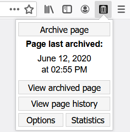

# Save to the Wayback Machine

Browser extension for quickly saving web pages to the Internet Archive's [Wayback Machine](https://web.archive.org).

### Features
* Detects if a page can or can not be archived.
* See the last time a page was archived.
* Save pages, images and links via the right click menu.
* Open archived versions of pages, images and links via the right click menu.
* Keep track of the number of pages that you have archived.

## Download

[Privacy Policy](PRIVACY.md) - [Browser Permissions](PRIVACY.md#browser-permissions) - [Installing in other browsers](INSTALL.md)

## Dependencies
- [Spacetime - JavaScript timezone library (version 6.16.1)](https://github.com/spencermountain/spacetime)

## Changelog

All notable changes to this project are documented in the [CHANGELOG](CHANGELOG.md).

## License

Code in this repository is licensed under the GNU General Public License Version 3. Details can be found in the [LICENSE](LICENSE) file. 

## Disclaimer

This is an unofficial extension and is not sponsored, owned, or endorsed by the [Internet Archive](https://archive.org).
