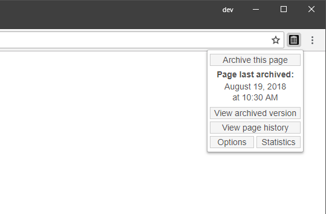

# Save to the Wayback Machine

Browser extension that lets you quickly save web pages to the Internet Archive's Wayback Machine. [More info here](https://verifiedjoseph.com/projects/save-to-the-wayback-machine).

## Dependencies
- [Spacetime - JavaScript timezone library (version 5.9.0)](https://github.com/spencermountain/spacetime)

## Download

[Privacy Policy](https://verifiedjoseph.com/extension-privacy-policy)

## License

Code in this repository is licensed under the GNU General Public License Version 3. Details can be found in the [LICENSE](LICENSE) file. 

## Disclaimer

This is an unofficial extension and is not sponsored, owned, or endorsed by the [Internet Archive](https://archive.org).
