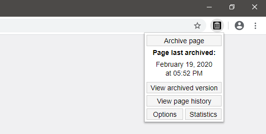

# Save to the Wayback Machine

Browser extension for quickly saving web pages to the Internet Archive's [Wayback Machine](https://web.archive.org).

### Features
* Detects if a page can or can not be archived.
* See the last time a page was archived.
* Save pages, images and links via the right click menu.
* Open archived versions of pages, images and links via the right click menu.
* Keep track of the number of pages that you have archived.

### Permissions
The extension requires the following five permissions:
* [Active Tab](https://developer.mozilla.org/en-US/docs/Mozilla/Add-ons/WebExtensions/manifest.json/permissions#activeTab_permission) - Access details about the browser's current tab (URL, title and status).
* [Storage](https://developer.mozilla.org/en-US/docs/Mozilla/Add-ons/WebExtensions/API/storage) - Load and save user options and statistics.
* [Notifications](https://developer.mozilla.org/en-US/docs/Mozilla/Add-ons/WebExtensions/API/notifications) - Create and display notifications.
* [Context Menus](https://developer.mozilla.org/en-US/docs/Mozilla/Add-ons/WebExtensions/API/menus) - Create right click menu options.
* Data from [archive.org](https://www.archive.org/) & [web.archive.org](https://archive.org/web/) - Send and receive data from the Wayback Machine. 

## Dependencies
- [Spacetime - JavaScript timezone library (version 5.9.0)](https://github.com/spencermountain/spacetime)

## Download

[Privacy Policy](https://verifiedjoseph.com/extension-privacy-policy)

## Changelog

All notable changes to this project are documented in the [CHANGELOG](CHANGELOG.md).

## License

Code in this repository is licensed under the GNU General Public License Version 3. Details can be found in the [LICENSE](LICENSE) file. 

## Disclaimer

This is an unofficial extension and is not sponsored, owned, or endorsed by the [Internet Archive](https://archive.org).
